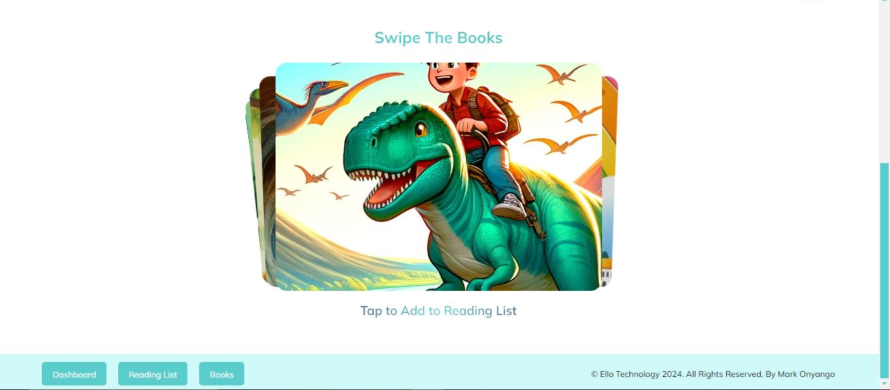
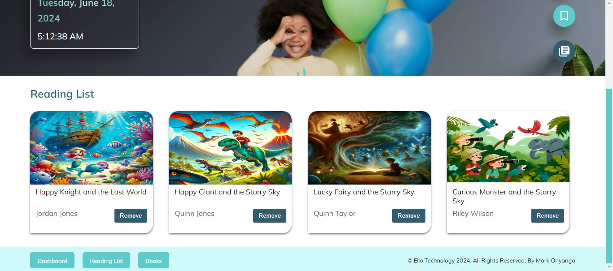

# Mark Onyango - Ello Engineering Challenge Solution

👋 Hello,

I am really excited about the opportunity to join the team and have designed this dashboard to showcase my React skills. Please keep an eye on the repository as I may commit improvement changes. Thank you for your time, and I hope to speak with you soon!

## About the Ello Teachers Dashboard

This is a full-stack repository containing two folders: `frontend` and `backend`. The backend was provided. Twinx Clutario, clarified via email that I should use it as-is. Therefore, full user authentication and other functionalities are not implemented on the backend. Please use "admin" as the username and "password" as the password to get authenticated.

**Note:** The backend does not include user authentication.

## Frontend

The frontend of this application is built with React 18.2.0 and initialized using Vite for its fast server start and development experience. Check [Why Vite?](https://vitejs.dev/guide/why.html). The project structure is organized to allow flexibility and scalability.

### Features

1. A search bar that allows users to search for books by title.
2. A list of search results that displays the book title, author, and a button to add the book to the teacher's reading list.
3. A reading list that displays all the books added by the teacher.
4. A button to remove a book from the reading list.

Currently, the application supports only one reading list per teacher, but it is designed to be flexible and scalable to accommodate more features.

### My Design Process

**1st Design**


**2nd Design**


**3rd Design**


**4rth Design**


**5th Design**


**6th Design**


**Last Design**


### Runnning The App

To run the backend, switch to `src/backend` folder and run

```bash
npm install
```

Then, start the server with:

```bash
npm start
```

To run the frontend, switch to `src/frontend` folder and run

```bash
npm install
```

Then, start the app with:

```bash
npm run dev
```

Connecting backend url

switch to `src/frontend` folder and create a new file called

```bash
 .env.local
```

inside the file, paste this code

```bash
 VITE_BACKEND_URL=http://localhost:4000/
```

### Styling Guidelines

Each React component has its own style file. Additionally, there are app.css and index.css files that contain general styles for the application.

### Coding Language

The application is developed in JavaScript, but I can convert it to TypeScript if your previous frontend is built on TypeScript.

### User-Centric Design 😊

While having the skills to implement a beautiful design is important, satisfying user requirements is paramount. I recommend involving users in the design process. Conducting a small pilot test with a group of users can provide valuable feedback on their experience with the dashboard. This feedback will help us improve our design to better meet customer needs.

### Possible improovemtts

- Gather feedback from real users on the interface and functionality.
- Integrate full user authentication.
- Associate reading lists with individual users.
- Link books to users.
- Integrate machine learning for book recommendations.
- Add more features.
